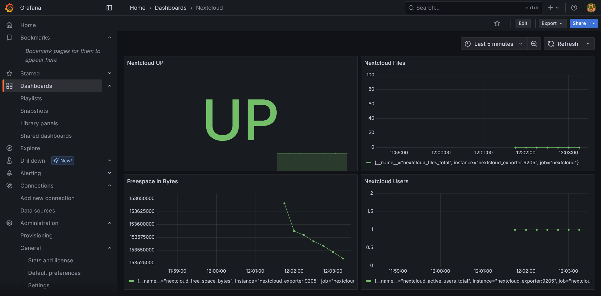

# m169-nextcloud Monitoring-Stack

Dieses Projekt stellt einen Monitoring- und Analyse-Stack rund um eine Nextcloud-Instanz bereit. Die einzelnen Dienste laufen in Docker-Containern und sorgen für Überwachung, Visualisierung und Export von Metriken.

## Services und Ports

| Service              | Beschreibung                                                                                                                     | Externer Port |
|----------------------|----------------------------------------------------------------------------------------------------------------------------------|---------------|
| **nextcloud_exporter** | Exportiert Metriken der Nextcloud-Instanz für Prometheus. Erfasst z. B. Benutzeraktivität, Speicherverbrauch und Systemstatus.   | 9205          |
| **mysqld_exporter**    | Exportiert Metriken der zugrundeliegenden MySQL/MariaDB-Datenbank, wie Abfragen, Verbindungen, Speicher und Replikation.         | 9104          |
| **prometheus**         | Zentrales Monitoring-System: Sammelt und speichert Metriken aller Exporter und bietet Abfrage- sowie Alerting-Möglichkeiten.     | 8020          |
| **grafana**            | Visualisierungstool: Erstellt Dashboards und Analysen auf Basis der von Prometheus gespeicherten Metriken.                       | 8030          |

---

### Service-Beschreibungen

#### Nextcloud
Nextcloud ist eine Open-Source-Lösung für Dateiablage, Synchronisation und Zusammenarbeit. Sie bietet Funktionen wie:
- Datei-Upload und -Sharing
- Webinterface und Desktop-/Mobile-Clients
- Benutzer- und Rechteverwaltung
- Integration zusätzlicher Apps (z. B. Kalender, Kontakte, Office)

Nextcloud läuft in einem eigenen Docker-Container und bildet das Herzstück des Projekts als Alternative zu kommerziellen Cloud-Lösungen wie OneDrive.

#### nextcloud_exporter (Port 9205)
Der Nextcloud Exporter sammelt Betriebs- und Nutzungsdaten aus der Nextcloud-Instanz, z. B. Benutzeranzahl, Dateispeicher, Last und Status. Diese Metriken werden Prometheus zur Verfügung gestellt und können in Grafana visualisiert werden.

#### mysqld_exporter (Port 9104)
Dieser Exporter sorgt dafür, dass Metriken aus der MySQL/MariaDB-Datenbank (wie Abfragezeiten, offene Verbindungen, Fehlerzustände usw.) exportiert und überwacht werden können.

#### prometheus (Port 8020)
Prometheus ist ein Open-Source Monitoring- und Alerting-System. Es sammelt regelmäßig Metriken von den Exportern, speichert diese und erlaubt flexible Abfragen zur Überwachung des Systemzustands. Zudem können Benachrichtigungen (Alerts) bei Problemen ausgelöst werden.

#### grafana (Port 8030)
Grafana dient zur Visualisierung der gesammelten Daten. Mit Hilfe von Dashboards können Trends, Auslastungen und Fehlerzustände übersichtlich dargestellt werden. Grafana bindet sich an Prometheus als Datenquelle an.

## Beispiel-Screenshots

### Monitoring Dashboard (Grafana)

Hier ist ein Beispiel für das Montitoring Dashboard von der Nextcloud Datenbank:

Hier ist ein Beispiel für das Montitoring Dashboard von der Nextcloud:

### Nextcloud

So sieht die Website von der Nextcloud aus:

